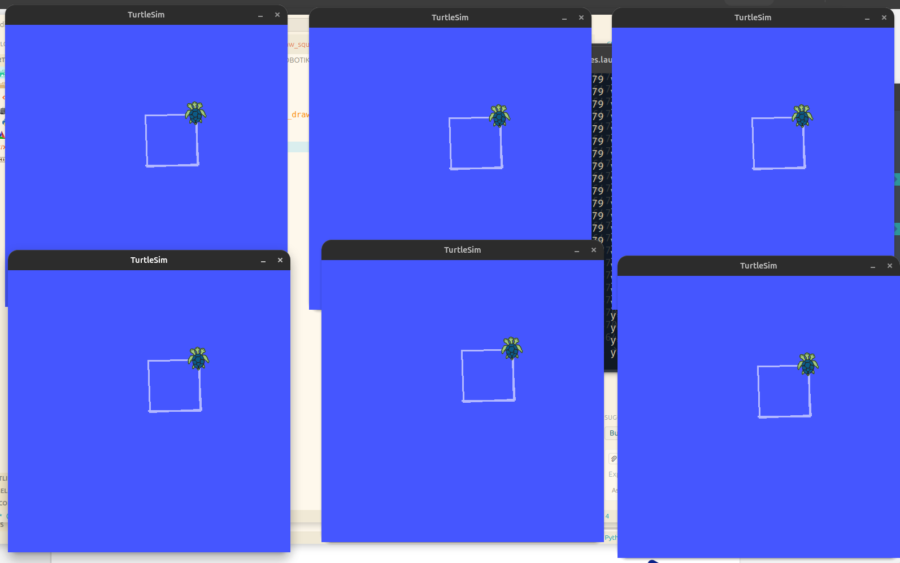
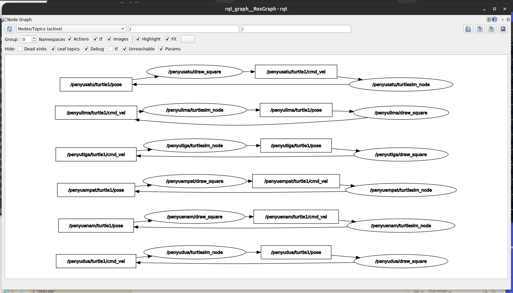

# PRAKTIKUM ROBOTIKA

### UPDATE ACCESS CODE
```
$ chmod +x scripts/*
```

### RUN TURTLESIM
```
$ roslaunch turtlesim_draw draw_six_turtles.launch
```

### OUTPUT

#### 6 Turtles


#### 6 Turtles Graph
